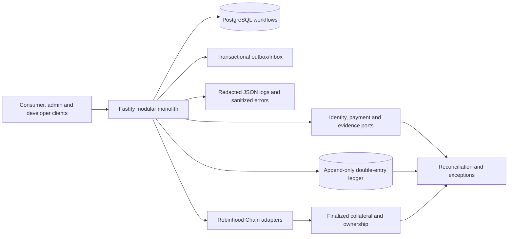

# System architecture

Afridict combines financial infrastructure with generalized prediction-market infrastructure. Binary, categorical, and scalar markets share one governed model. The synthetic execution stack includes a deterministic CLOB, a bounded protocol AMM backstop, and signed institutional RFQ. Robinhood Chain is the committed settlement network.

## Authoritative state

| Fact | Authority |
| --- | --- |
| Authentication | Afridict-native password/session authority plus explicitly linked immutable Google subjects |
| Roles and capability decisions | Afridict PostgreSQL policy records |
| Contact possession | Afridict normalized timestamps backed by Twilio Verify results |
| Identity-document status | Afridict normalized state backed by Persona |
| Operational workflows | PostgreSQL state machines |
| Off-chain money | Append-only Afridict double-entry ledger |
| Wallet conversion terms | Append-only finance rate snapshot copied into an immutable customer quote |
| Orders and matches | Deterministic synthetic CLOB journal |
| External NGN payment state | Reconciled Swervpay records and finance decisions |
| Final collateral and outcome ownership | Finalized Robinhood Chain state |
| Market outcome | Governed evidence/resolution record plus chain finalization |

Read models, caches, partner webhooks, RPC responses, indexers, and transaction hashes are observations. They do not replace these authorities. Differences create owned reconciliation exceptions.

SwervPay collection instructions are created by a retry-safe worker. A completed collection webhook must match the configured shared secret, business ID, Afridict deposit reference, expected amount, `COMPLETED` status, and `CREDIT` type. The provider transaction ID and payload hash prevent duplicate or conflicting credits. Provider naira values are converted to Afridict kobo only at this adapter boundary.

## Security and integrity

All financial values use explicit assets and integer minor units. Journals balance per asset and remain append-only. One owner/asset lock serializes reservations across withdrawals and future CLOB, AMM, and RFQ paths. Commands use idempotency records, privileged actions produce audit and outbox events, and production runs with a restricted database role.

NGN/USDT conversion uses two balanced journals linked by one trade because assets with different units cannot balance in one journal. Deterministically ordered locks cover both customer balances and both ring-fenced treasury inventories. Quote creation does not reserve funds; acceptance rechecks expiry, the source balance and destination inventory in one transaction. See [ADR 0012](adr/0012-ring-fenced-wallet-conversion.md).

Market collateral policy separates the universal 1,000,000 probability-price scale from asset-specific contract payout units. One published event can activate independent `(market_id, asset_code)` books for NGN and `USDT_BSC`. CLOB, AMM, RFQ, positions, realtime sequences, payouts, and settlement manifests remain inside the selected book; they cannot cross or sum unlike assets. Every book shares the event's governed resolution result. The caller collateral projection lets clients choose the correct wallet without guessing or silently converting. See [ADR 0013](adr/0013-governed-market-collateral-units.md) and [ADR 0016](adr/0016-currency-specific-market-books.md).

The account portfolio exposes NGN and USD as separate wallets. USD maps to exact `USDT_BSC` token units and a custody-controlled BNB Smart Chain address. Browser transaction references are discovery hints only; a read-only chain observer verifies the canonical `Transfer` log and confirmation policy before an append-only ledger credit. See [ADR 0015](adr/0015-independent-usdt-bsc-deposits.md).

Realtime delivery reads the canonical append-only market sequence rather than creating a second trading state. Browser clients exchange their bearer-authenticated HTTP session for a one-use ticket, authenticate the WebSocket in its first frame, and resume after the last contiguous sequence they applied. Market events contain no customer identity; order-book snapshots contain aggregate depth, while position snapshots are scoped to the ticket owner. Slow connections are closed with a recovery cursor instead of accumulating an unbounded queue.

Provider SDKs and payloads terminate at adapter boundaries. Domain modules use normalized Afridict types. Secrets, OTPs, raw KYC documents, and customer data are excluded from logs, examples, analytics, and general events.

Pino emits structured operational logs with request and OpenAPI operation identifiers. Optional Sentry reporting receives sanitized exception types and stack frames plus non-customer correlation identifiers. Request bodies, headers, users, breadcrumbs, exception messages, provider payloads, and financial details are excluded from external error reports. See [ADR 0008](adr/0008-privacy-safe-operational-telemetry.md).

The modular monolith is intentional. Services are extracted only for measured latency, fault isolation, security, scaling, deployment, or ownership needs. Deterministic matching may become a separate service when workload evidence justifies it.
